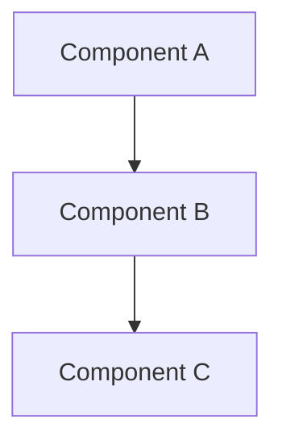

# Playbook: [ENGAGEMENT TYPE]

> **Version**: 1.0 | **Last Updated**: YYYY-MM-DD

## Overview

**What this project type involves**: [1-2 paragraphs describing the domain]

**Typical client profile**: [Who commissions this type of work]

**What success looks like**: [Measurable outcomes that define a successful engagement]

---

## Discovery Questions

Questions to ask during pre-sales and early discovery, organized by theme. Each notes which phase benefits most.

### Business

| # | Question | Phase |
|---|----------|-------|
| 1 | [Question about business goals] | Pre-sales |
| 2 | [Question about stakeholders] | Pre-sales |

### Technical

| # | Question | Phase |
|---|----------|-------|
| 1 | [Question about existing systems] | Pre-sales / Setup |
| 2 | [Question about constraints] | Setup |

### Data

| # | Question | Phase |
|---|----------|-------|
| 1 | [Question about data sources] | Pre-sales |
| 2 | [Question about data quality] | Setup |

### Operations

| # | Question | Phase |
|---|----------|-------|
| 1 | [Question about deployment] | Setup |
| 2 | [Question about monitoring] | Design |

---

## Typical Architecture Patterns

### Pattern: [NAME]

**When to use**: [Conditions where this pattern applies]

**Components**: [List of components]

**Trade-offs**: [Pros and cons]

### Pattern: [NAME 2]

**When to use**: [Conditions]

**Components**: [List]

**Trade-offs**: [Pros and cons]

---

## Common Spec Decomposition

Typical specs for this engagement type. Use as a starting point for proposed specs.

| Area | Spec Scope | Effort Range | Frequency |
|------|-----------|--------------|-----------|
| [Area 1] | [What it covers] | S-M | Always |
| [Area 2] | [What it covers] | M-L | Often |
| [Area 3] | [What it covers] | S | Sometimes |

---

## Estimation Patterns

### Effort Drivers

- [Factor that increases effort] — [how it impacts]
- [Factor that decreases effort] — [how it impacts]

### ROM Ranges by Complexity

| Complexity | Typical Range | Key Indicators |
|-----------|--------------|----------------|
| Simple | [range] | [indicators] |
| Moderate | [range] | [indicators] |
| Complex | [range] | [indicators] |

### Common Multipliers

- [Multiplier] — [when to apply, typical factor]

---

## Risk Patterns

Domain-specific risks with mitigations.

| # | Risk | Likelihood | Impact | Mitigation |
|---|------|-----------|--------|------------|
| 1 | [Risk description] | Medium | High | [Mitigation approach] |
| 2 | [Risk description] | Low | High | [Mitigation approach] |

---

## Tech Stack Recommendations

| Layer | Default | Alternatives | Notes |
|-------|---------|-------------|-------|
| [Layer 1] | [Default choice] | [Alt 1], [Alt 2] | [When to deviate] |
| [Layer 2] | [Default choice] | [Alt 1], [Alt 2] | [When to deviate] |

---

## Quality Gates

Domain-specific gates to seed the constitution.

| Gate | Category | Criteria | Severity |
|------|----------|----------|----------|
| [Gate 1] | [Category] | [Pass criteria] | MUST |
| [Gate 2] | [Category] | [Pass criteria] | SHOULD |

---

## Deliverable Checklist

### Pre-Sales Phase

- [ ] [Deliverable 1]
- [ ] [Deliverable 2]

### Kickoff Phase

- [ ] [Deliverable 1]
- [ ] [Deliverable 2]

### Per-Spec Phase

- [ ] [Deliverable 1]
- [ ] [Deliverable 2]

### Closeout Phase

- [ ] [Deliverable 1]
- [ ] [Deliverable 2]

---

## Anti-Patterns

Things to watch for and avoid in this engagement type.

| Anti-Pattern | Why It's Bad | What to Do Instead |
|-------------|-------------|-------------------|
| [Anti-pattern 1] | [Consequence] | [Better approach] |
| [Anti-pattern 2] | [Consequence] | [Better approach] |
