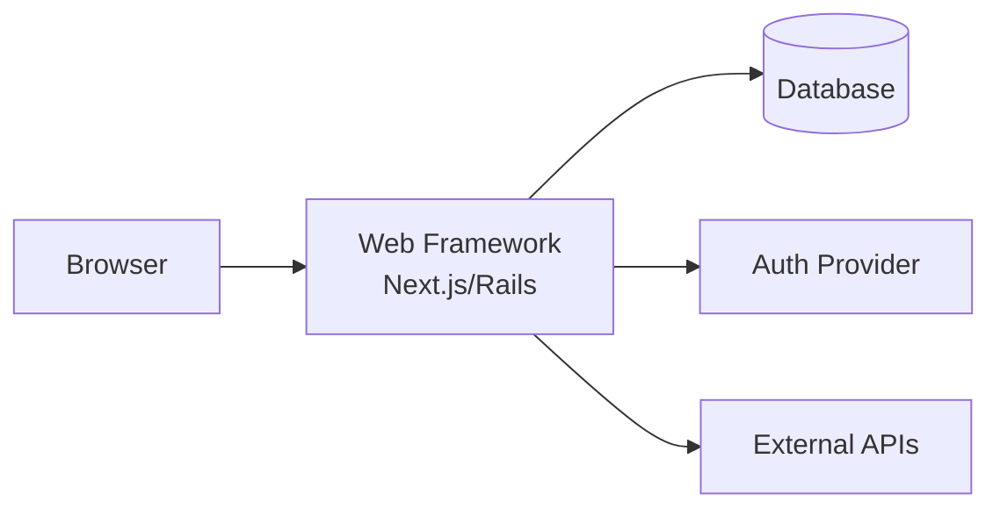

# Playbook: Custom Applications

> **Version**: 1.0 | **Last Updated**: 2026-03-11

## Overview

**What this project type involves**: Building bespoke web applications, mobile apps, or SaaS products. These projects take a client's unique business process or product vision and turn it into working software — from CRUD apps and internal tools to customer-facing products.

**Typical client profile**: Organizations with a workflow or product idea that can't be solved by off-the-shelf software. They need something tailored to their domain, users, and processes.

**What success looks like**: Users adopt the application, it solves the intended business problem, and it's maintainable by the client's team (or a support engagement) post-delivery.

---

## Discovery Questions

### Business

| # | Question | Phase |
|---|----------|-------|
| 1 | What business process or product does this application support? | Pre-sales |
| 2 | Who are the primary users? How many? What's their technical skill level? | Pre-sales |
| 3 | Is this replacing an existing system or a new capability? | Pre-sales |
| 4 | What does success look like in 6 months? In 2 years? | Pre-sales |

### Technical

| # | Question | Phase |
|---|----------|-------|
| 1 | What's your hosting environment? (cloud provider, on-prem, hybrid) | Pre-sales |
| 2 | What existing systems does this need to integrate with? | Pre-sales |
| 3 | What's your current tech stack / team's expertise? | Setup |
| 4 | Are there performance requirements? (response time, concurrent users) | Setup |

### Data

| # | Question | Phase |
|---|----------|-------|
| 1 | What data does this application manage? Volume and sensitivity? | Pre-sales |
| 2 | Are there data migration needs from existing systems? | Pre-sales |
| 3 | What are the backup and recovery requirements? | Setup |

### Operations

| # | Question | Phase |
|---|----------|-------|
| 1 | Who will maintain this application post-delivery? | Pre-sales |
| 2 | What's your CI/CD maturity? (manual deploy, GitHub Actions, etc.) | Setup |
| 3 | What uptime requirements exist? (SLA, business hours only, 24/7) | Setup |

---

## Typical Architecture Patterns

### Pattern: Server-Side Rendered Web App

**When to use**: Content-heavy applications, SEO requirements, simpler interactivity. Internal tools, dashboards, CMS-backed sites.

**Components**: Web framework (Next.js/Rails/Django), database, server-side rendering, auth, deployment

**Trade-offs**: Simpler architecture, better SEO, faster initial load. Less interactive than SPA for complex UIs.

### Pattern: SPA + API Backend

**When to use**: Highly interactive UIs, real-time features, mobile app alongside web. When frontend and backend teams work independently.

**Components**: SPA frontend (React/Vue), REST/GraphQL API, database, auth, CDN

**Trade-offs**: Rich interactivity, API reusability. More complex deployment, SEO requires extra work.

### Pattern: Mobile-First with Shared API

**When to use**: Primary audience is mobile. May have web companion. Offline capability needed.

**Components**: Native/cross-platform mobile (React Native/Flutter), REST API, push notifications, offline sync

**Trade-offs**: Best mobile UX, platform-specific features. Higher development cost (two platforms).

---

## Common Spec Decomposition

| Area | Spec Scope | Effort Range | Frequency |
|------|-----------|--------------|-----------|
| Auth & User Management | Registration, login, roles, permissions, profile | S-M | Always |
| Core Domain Model | Primary entities, relationships, business logic | M-L | Always |
| Primary Workflow | Main user journey through the application | M-L | Always |
| Admin Interface | Configuration, user management, content management | S-M | Often |
| Notifications | Email, push, in-app notifications | S-M | Often |
| Search | Full-text search, filtering, sorting | S-M | Often |
| Reporting / Analytics | Dashboards, exports, usage analytics | M | Often |
| File Management | Upload, storage, processing, serving | S-M | Sometimes |
| Integration Layer | Third-party API connections, webhooks | M | Sometimes |
| Data Migration | Import from legacy system, validation, reconciliation | M-L | Sometimes |

---

## Estimation Patterns

### Effort Drivers

- **Number of user roles / permission complexity** — each role adds authorization logic and UI variations
- **Workflow complexity** — multi-step processes with branching logic take more design and testing
- **Integration count** — each external system has unique API patterns and error handling
- **Offline requirements** — offline-first adds sync logic, conflict resolution, local storage
- **Data migration** — migrating from legacy systems is unpredictable; data quality varies

### ROM Ranges by Complexity

| Complexity | Typical Range | Key Indicators |
|-----------|--------------|----------------|
| Simple | 200-500 hours | Single user role, CRUD operations, no integrations, standard auth |
| Moderate | 500-1200 hours | 2-3 roles, complex workflows, 1-3 integrations, file handling |
| Complex | 1200-2500 hours | Multi-tenant, complex permissions, many integrations, offline support, data migration |

### Common Multipliers

- **Accessibility (WCAG AA)** — 1.2-1.3x for comprehensive accessibility compliance
- **Multi-language (i18n)** — 1.2x per additional language
- **Data migration** — add 100-400 hours depending on source complexity

---

## Risk Patterns

| # | Risk | Likelihood | Impact | Mitigation |
|---|------|-----------|--------|------------|
| 1 | Requirements change during implementation — "that's not what I meant" | High | High | Spec-driven approach with client review at each phase. Demo after each spec implementation. |
| 2 | Integration APIs are undocumented, unreliable, or different from spec | Medium | High | Prototype integrations early. Build adapter pattern for isolation. |
| 3 | Performance issues under real load | Medium | Medium | Load test before launch. Design for expected concurrent users from day one. |
| 4 | Low user adoption post-launch | Medium | High | Involve real users in spec validation. Conduct usability testing before full rollout. |
| 5 | Scope creep through "small" UI tweaks | High | Medium | Define acceptance criteria per spec. UI refinement is a separate spec, not implementation feedback. |

---

## Tech Stack Recommendations

| Layer | Default | Alternatives | Notes |
|-------|---------|-------------|-------|
| Frontend | Next.js (React) | Vue/Nuxt, Angular, Svelte | Next.js for SSR + SPA flexibility |
| Backend API | Node.js (Express/Fastify) | Python (FastAPI), C# (.NET), Go | Match client team's expertise |
| Database | PostgreSQL | MySQL, SQL Server, MongoDB | PostgreSQL for most use cases |
| Auth | Auth0 / Clerk | Cognito, Firebase Auth, custom | Managed auth reduces risk |
| File Storage | S3 / Azure Blob | GCS, local filesystem | Cloud storage for production |
| Deployment | Vercel / AWS | Azure App Service, GCP Cloud Run | Vercel for Next.js; cloud provider match for others |
| CI/CD | GitHub Actions | GitLab CI, Azure DevOps | Match client's git platform |

---

## Quality Gates

| Gate | Category | Criteria | Severity |
|------|----------|----------|----------|
| Responsive Design | UX | Application works on mobile, tablet, and desktop viewports | MUST |
| Auth Security | Security | Authentication and authorization tested for privilege escalation | MUST |
| Input Validation | Security | All user inputs validated server-side | MUST |
| Performance | Performance | P95 page load < 3s on standard connection | SHOULD |
| Accessibility | UX | WCAG 2.1 AA compliance for all user-facing pages | SHOULD |
| Error Handling | Reliability | All error states have user-friendly messages and logging | MUST |
| Test Coverage | Testing | > 80% coverage for business logic; E2E tests for critical paths | SHOULD |

---

## Deliverable Checklist

### Pre-Sales Phase

- [ ] User role definitions and primary workflows identified
- [ ] Integration inventory with access requirements
- [ ] Technology recommendation aligned with client capabilities

### Kickoff Phase

- [ ] Design system / UI framework selected
- [ ] Development environment with CI/CD pipeline
- [ ] Database schema design
- [ ] Authentication flow implemented

### Per-Spec Phase

- [ ] Working feature matching acceptance criteria
- [ ] Tests (unit + integration for the feature)
- [ ] API documentation (if applicable)

### Closeout Phase

- [ ] Production deployment with monitoring
- [ ] User documentation or in-app help
- [ ] Operations runbook (deployment, backup, troubleshooting)
- [ ] Knowledge transfer to client team

---

## Anti-Patterns

| Anti-Pattern | Why It's Bad | What to Do Instead |
|-------------|-------------|-------------------|
| Building the whole UI before any backend | Disconnected frontend that needs rework when integrated | Build vertical slices: one feature end-to-end at a time |
| Rolling custom auth | Security vulnerabilities, maintenance burden | Use managed auth (Auth0, Clerk, Cognito) unless there's a specific reason not to |
| Ignoring mobile responsiveness until polish | Fundamental layout rework needed late in the project | Start with mobile-first responsive design from spec one |
| Over-abstracting for "future flexibility" | Adds complexity without proven benefit | Build for current requirements. Refactor when new requirements prove the need. |
| Skipping load testing | Works fine in dev, falls over in production | Load test with realistic user counts before launch |
