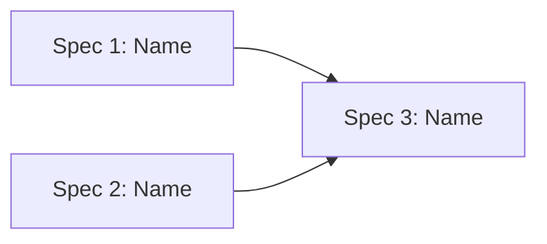

# Proposal

| Field | Value |
|-------|-------|
| **Client** | [Client name] |
| **Date** | [YYYY-MM-DD] |
| **Version** | 1.0 |
| **Status** | Draft |
| **What We Heard** | [Link to what-we-heard.md] |

---

## Executive Summary

[1-2 paragraphs. What we're proposing, why it works for this client, and the high-level approach. Written for executive audience.]

---

## Understanding

[Brief restatement of the business problem and desired outcomes. References what-we-heard.md for detail — does not duplicate it.]

---

## Proposed Approach

### Solution Overview

[2-3 paragraphs describing the overall solution approach. What are we building? How does it address the client's needs? What makes this approach appropriate?]

### Playbook Alignment

[Which playbook(s) inform this approach and why. Reference `.specify/playbooks/` entries.]

---

## Proposed Specs

Preliminary scope components that will become formal delivery specs. Each proposed spec maps to a coherent, deliverable capability.

| # | Name | Description | Effort | Phase |
|---|------|-------------|--------|-------|
| 1 | [Name] | [What this delivers] | S / M / L / XL | 1 |
| 2 | [Name] | [Description] | | |
| 3 | [Name] | [Description] | | |

### Dependency Sketch

---

## Phasing

| Phase | Goal | Proposed Specs | Duration |
|-------|------|-----------|----------|
| 1 — Foundation | [What Phase 1 achieves] | [Spec names] | [From source docs or TBD] |
| 2 — Full Capability | [What Phase 2 achieves] | [Spec names] | [From source docs or TBD] |

---

## Technology Approach

| Layer | Recommendation | Rationale |
|-------|---------------|-----------|
| [Platform / Cloud] | [Choice] | [Why this fits] |
| [Backend / Framework] | [Choice] | [Why] |
| [Data / Storage] | [Choice] | [Why] |
| [AI / ML] | [Choice if applicable] | [Why] |
| [Frontend / UI] | [Choice] | [Why] |

---

## Assumptions

- [Key assumption about scope, technology, or constraints]
- [Assumption about client responsibilities]
- [Assumption about environment or access]

---

## Risks

| ID | Risk | Likelihood | Impact | Mitigation |
|----|------|-----------|--------|------------|
| R-001 | [Risk description] | Low / Medium / High | Low / Medium / High | [Mitigation approach] |
| R-002 | [Risk] | | | |

---

## Clarifying Questions

### QA — Questions We Can Answer (with assumptions)

| # | Question | Our Assumption | Confidence | Impact if Wrong |
|---|----------|---------------|------------|-----------------|
| 1 | [Question] | [What we assume] | High / Medium / Low | [What changes if wrong] |

### QC — Questions for the Client

| # | Question | What It Blocks | Options |
|---|----------|---------------|---------|
| 1 | [Question needing client input] | [What can't proceed without this] | [Choices if applicable] |

---

## ROM

[Rough order of magnitude estimate if enough information is available. Otherwise, state what's needed to provide one.]

| Proposed Spec | Effort | Hours Range | Confidence |
|---------------|--------|------------|------------|
| [Spec name] | M | [Range] | Medium |
| [Spec name] | L | [Range] | Low |
| **Total** | | **[Range]** | |

*ROM is indicative and subject to refinement during SOW scoping.*

---

## Information Gaps

| Gap | What It Blocks | Resolves With |
|-----|---------------|---------------|
| [Missing information] | [Which specs or estimates are affected] | [How to resolve — client meeting, document, decision] |

---

## Next Steps

- [ ] Client reviews proposal and provides feedback
- [ ] Resolve QC questions
- [ ] Validate QA assumptions
- [ ] If aligned, proceed to SOW scoping (`/ais.presales.scope`)
